# France Emploi - Pipeline ETL End-to-End sur les Données Ouvertes du Gouvernement

Pipeline de data engineering de niveau production qui collecte, ingère, transforme et expose les données françaises de l'emploi issues des API officielles du gouvernement. Construit sur une stack cloud-native moderne combinant Apache Airflow, Google Cloud Platform, Snowflake et dbt, avec une infrastructure entièrement automatisée provisionnée par Terraform.

---

## Table des matières

1. [Vue d'ensemble du projet](#1-vue-densemble-du-projet)
2. [Architecture](#2-architecture)
3. [Stack technologique](#3-stack-technologique)
4. [Sources de données](#4-sources-de-données)
5. [Conception du pipeline](#5-conception-du-pipeline)
   - [Collecte des données - DAGs Airflow](#51-collecte-des-données--dags-airflow)
   - [Ingestion cloud - Snowpipe Auto-Ingest](#52-ingestion-cloud--snowpipe-auto-ingest)
   - [Transformations - dbt](#53-transformations--dbt)
6. [Couches de modèles dbt](#6-couches-de-modèles-dbt)
7. [Qualité des données et tests](#7-qualité-des-données-et-tests)
8. [Infrastructure - Terraform](#8-infrastructure--terraform)
9. [Structure du projet](#9-structure-du-projet)
10. [Mise en route](#10-mise-en-route)
    - [Prérequis](#101-prérequis)
    - [Gestion des accès GCP - principe du moindre privilège](#102-gestion-des-accès-gcp--principe-du-moindre-privilège)
    - [Étape 1 - Infrastructure GCP](#103-étape-1--infrastructure-gcp)
    - [Étape 2 - Initialisation Snowflake](#104-étape-2--initialisation-snowflake)
    - [Étape 3 - Airflow (local)](#105-étape-3--airflow-local)
    - [Étape 4 - Configuration dbt](#106-étape-4--configuration-dbt)

---

## 1. Vue d'ensemble du projet

Ce projet construit un pipeline ELT complet sur quatre jeux de données ouverts publiés par les organismes gouvernementaux français (DARES, UNEDIC, INSEE). Les données sont collectées selon un calendrier défini, stockées dans Google Cloud Storage, automatiquement ingérées dans Snowflake via Snowpipe, puis transformées en marts analytiques prêts à l'emploi grâce à dbt.

**Ce que le pipeline produit :**

| Mart | Description |
|------|-------------|
| `mart_territoire` | Snapshot instantané par département - taux de chômage, densité d'offres d'emploi, allocation journalière moyenne |
| `mart_desequilibre_emploi` | Score mensuel de déséquilibre du marché de l'emploi par département - ratio demandeurs/offres pondéré par le taux de chômage |
| `mart_evolution_temporelle` | Série temporelle mensuelle complète par département avec évolution mois sur mois en pourcentage |
| `dim_territoire` | Référentiel géographique (101 départements français avec correspondance régionale) |
| `dim_tranche_age` | Référentiel des tranches d'âge avec indicateur de population active |

Le pipeline traite plus de **800 000 enregistrements** en staging sur quatre flux de données distincts et produit des analytics mensuelles granulaires au niveau départemental.

---

## 2. Architecture

### Architecture logique
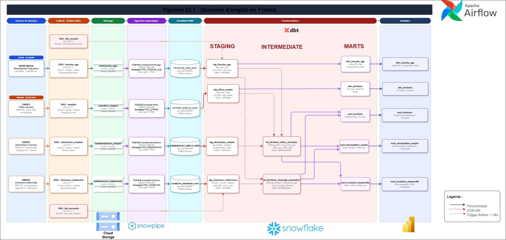

---

### Infrastructure déployée

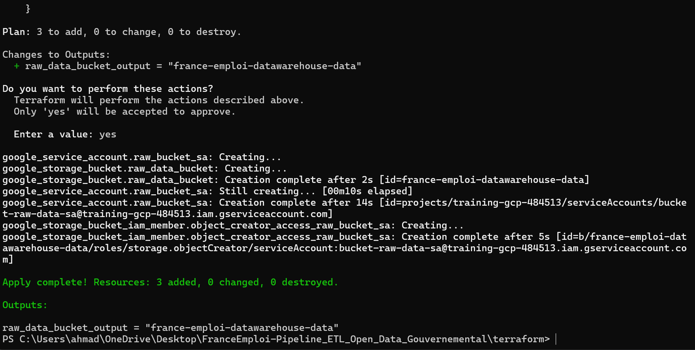

---

## 3. Stack technologique

| Couche | Outil | Version | Rôle |
|--------|-------|---------|------|
| Orchestration | Apache Airflow | 3.1.6 | Planification des DAGs, exécution des tâches, logique de retry |
| Exécution | CeleryExecutor + Redis | 7.2 | File de tâches distribuée |
| Base de métadonnées | PostgreSQL | 16 | État Airflow et métadonnées des DAGs |
| Stockage objet | Google Cloud Storage | - | Zone d'atterrissage des fichiers bruts |
| Bus d'événements | Google Cloud Pub/Sub | - | Notifications GCS → Snowpipe |
| Entrepôt de données | Snowflake | - | Stockage, ingestion via Snowpipe, moteur de requêtes |
| Transformation | dbt (data build tool) | 1.11.7 | Transformations SQL modulaires + tests |
| Adaptateur dbt | dbt-snowflake | 1.11.3 | Compilation et exécution spécifiques à Snowflake |
| Infrastructure as Code | Terraform | >= 1.0 | Provisionnement des ressources GCP |
| Conteneurisation | Docker + Docker Compose | - | Environnement de développement local reproductible |
| Provider GCP | Airflow Providers Google | 10.22.0 | Opérateurs et hooks GCS |
| Langage | Python | 3.x | Logique des DAGs, clients API, utilitaires de retry |

---

## 4. Sources de données

Toutes les données sont en accès libre et publiées par les organismes gouvernementaux français sous licence open data.

| Jeu de données | Source | Fréquence | Description |
|----------------|--------|-----------|-------------|
| Chômeurs indemnisés par département | UNEDIC | Mensuelle | Allocataires chômage par département - effectifs, montants des allocations, dépenses |
| Demandeurs d'emploi par tranche d'âge | DARES | Mensuelle | Demandeurs d'emploi par tranche d'âge et catégorie (A, B, C, D, E) - niveau national |
| Offres d'emploi France Travail | DARES | Mensuelle | Offres collectées et satisfaites par département, durée de contrat et qualification - depuis 1995 |
| Population par tranche d'âge | INSEE Melodi (Recensement) | Annuelle | Estimations de population active par âge, sexe et département - utilisées pour normaliser les taux de chômage |

Les données sont récupérées via des API REST/SDMX, converties en JSON newline-delimited, et stockées dans GCS avant ingestion.

---

## 5. Conception du pipeline

### 5.1 Collecte des données - DAGs Airflow

La couche de collecte se compose de quatre DAGs Airflow, chacun responsable d'une source de données. Les DAGs partagent un schéma commun en trois tâches :

1. `archive_current_if_exists` - déplacer le fichier de la période précédente vers le préfixe archive dans GCS
2. `extract_data` - paginer l'API source et assembler le jeu de données complet
3. `upload_to_gcs` - écrire le JSON newline-delimited vers le préfixe `current/`

Infrastructure commune à tous les DAGs de collecte :

- **Retry avec backoff exponentiel** et nombre de tentatives configurable (`fetch_xml_json_with_retry`)
- **Conventions de chemin GCS structurées** : `raw/{source}/current/{source}.json` et `raw/{source}/archive/{source}_{date}.json`
- **Taxonomie de tags partagée** via `get_collected_tags()` pour la catégorisation des DAGs dans l'UI Airflow
- **Écritures en streaming** pour les grands jeux de données (population INSEE 500 000+ enregistrements) afin d'éviter la pression mémoire

**Planifications :**

| DAG | Cron | Justification |
|-----|------|---------------|
| `chomeurs_indemnise` | `0 0 1 * *` | 1er du mois à minuit |
| `emploie` | `0 0 1 * *` | 1er du mois à minuit |
| `demandeur_emploie` | `0 0 1 * *` | 1er du mois à minuit |
| `tranche_age` | `0 0 1 1 *` | 1er janvier de chaque année |

#### Vue d'ensemble des DAGs

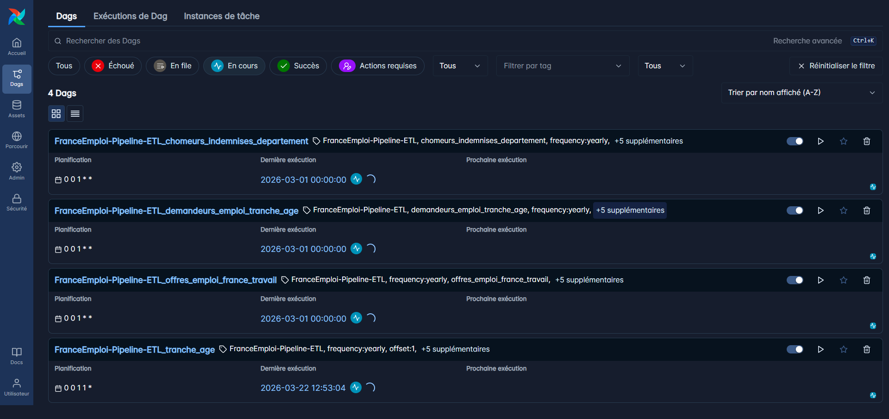

#### Template d'un DAG de collecte

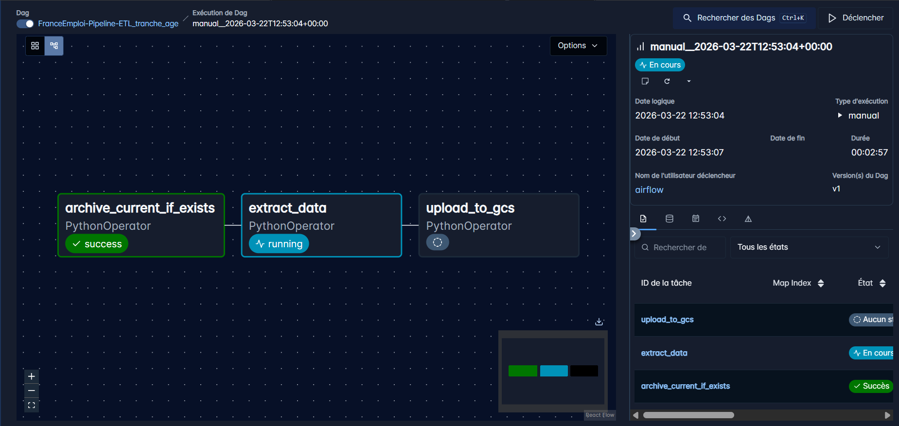

---

### 5.2 Ingestion cloud - Snowpipe Auto-Ingest

#### Pourquoi Snowpipe pour ce projet

Snowpipe est particulièrement adapté à ce cas d'usage car les fichiers collectés sont **incrémentiels** : leur taille évolue continuellement à chaque nouvelle livraison mensuelle (offres depuis 1995, allocataires depuis 2018). À la différence d'un COPY INTO déclenché manuellement, Snowpipe surveille en permanence le bucket GCS et charge automatiquement chaque nouveau fichier dès son dépôt - garantissant une **ingestion en quasi-temps réel** sans supervision humaine ni polling coûteux.

**Flux d'ingestion :**
```
Dépôt du fichier dans GCS
  → Notification Cloud Storage (OBJECT_FINALIZE)
    → Topic Pub/Sub (snowpipe-{source})
      → Subscription Pub/Sub (snowpipe-{source}-sub)
        → Snowpipe (auto_ingest = TRUE)
          → Table raw ({SOURCE}_RAW) dans le schéma PUBLIC de Snowflake
```

#### Rôle de Pub/Sub

Google Cloud Pub/Sub est le **bus de messages** entre GCS et Snowflake. Lorsqu'un fichier est finalisé dans GCS, une notification est publiée sur le topic Pub/Sub correspondant. La subscription associée conserve ce message jusqu'à ce que Snowpipe le consomme et lance le chargement. Ce découplage garantit qu'aucune notification ne se perd, même si Snowpipe est temporairement indisponible.

Chaque source de données dispose de son propre couple topic/subscription dédié. Les tables raw stockent chaque fichier JSON dans une colonne `VARIANT` (`raw_data`), préservant la fidélité totale de la donnée brute pour le parsing ultérieur par dbt.

#### Intégration GCS Storage (côté Snowflake)

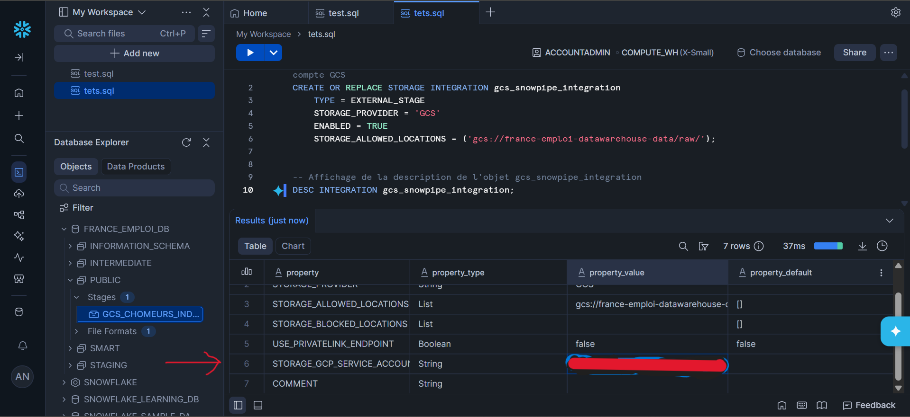

#### Intégration GCS Storage (côté GCS)

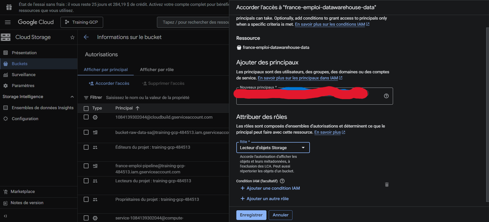

#### Vue d'ensemble des Topics Pub/Sub

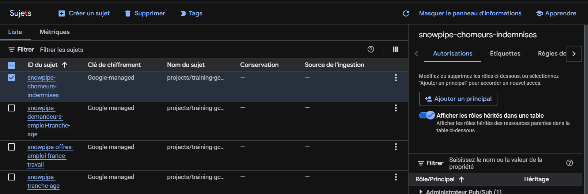

#### Vue d'ensemble des Subscriptions Pub/Sub

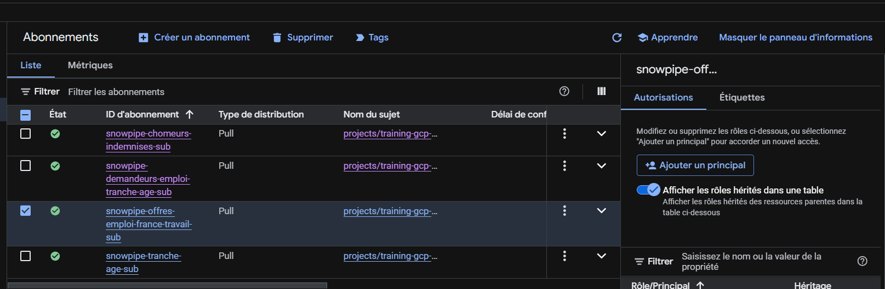

#### Connexion Snowflake → Pub/Sub

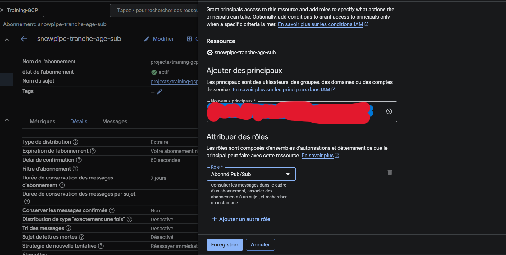

#### Rôles IAM des subscribers

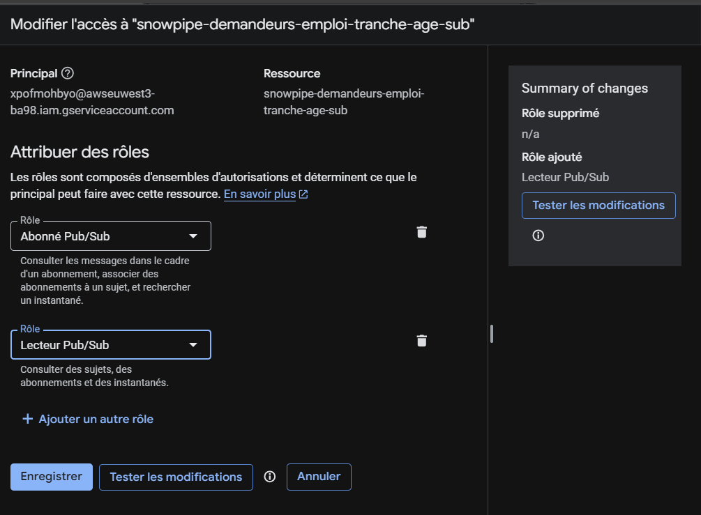

#### Exemple de template de subscription

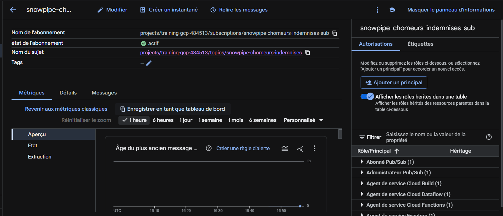

#### Schéma PUBLIC Snowflake - Tables raw

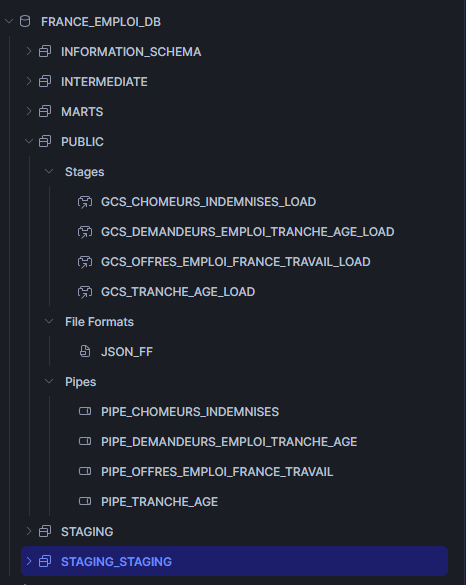

---

### 5.3 Transformations - dbt

Les transformations s'exécutent via deux DAGs Airflow (`dbt_transformations_mensuelle`, `dbt_transformations_annuelle`) en utilisant `dbt build` - qui compile, exécute et teste les modèles dans l'ordre des dépendances en une seule commande.

Chaque DAG utilise un `PythonOperator` qui appelle `dbt build` via `subprocess`, capture la sortie standard ligne par ligne, et classe chaque ligne en `INFO`, `WARNING` ou `ERROR` par correspondance de regex. Un code de retour non nul lève une `AirflowException` avec la liste des nœuds en échec.

**Planifications :**

| DAG | Cron | Sélection |
|-----|------|-----------|
| `dbt_transformations_mensuelle` | `0 3 1 * *` | `stg_chomeurs_indemnises+ stg_offres_emploi_france_travail+ stg_demandeur_emploi_tranche_age+` |
| `dbt_transformations_annuelle` | `0 2 2 1 *` | `stg_tranche_age+` |

L'opérateur `+` sélectionne le modèle et toutes ses dépendances aval - staging, intermediate et marts sont reconstruits dans le bon ordre.

#### DAGs de transformation dbt

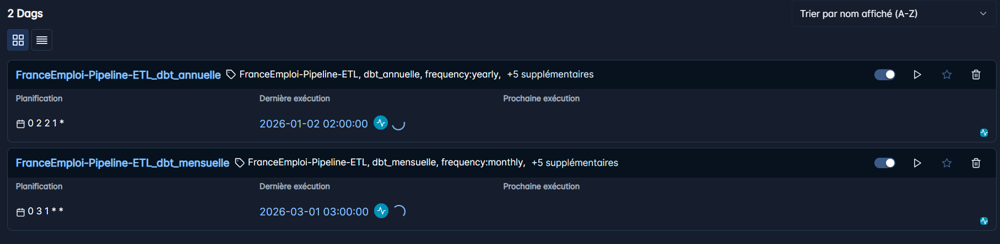

#### DAG dbt build annuel

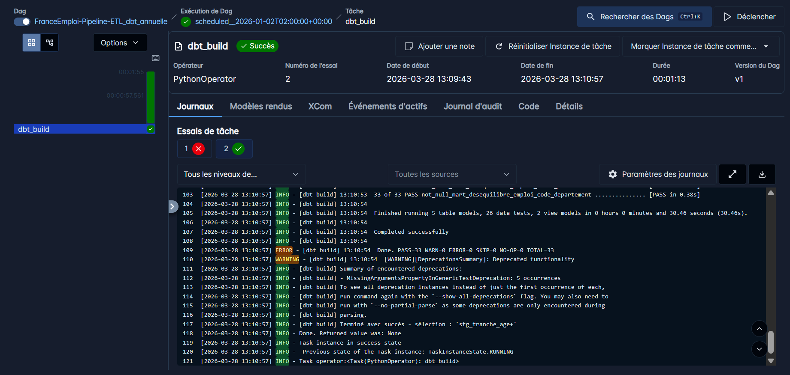

#### DAG dbt build mensuel

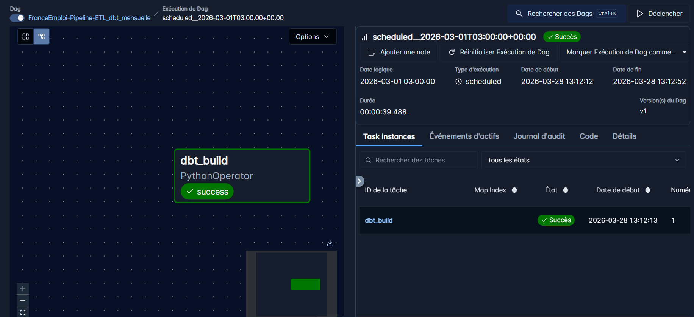

---

## 6. Couches de modèles dbt

Le projet dbt suit une architecture medallion en trois couches. Chaque couche a une responsabilité bien définie.

### Staging - Brut vers typé

Les modèles staging n'effectuent **aucun filtrage et aucune logique métier**. Leur seule responsabilité est de parser la colonne JSON `VARIANT`, caster les champs vers les types SQL corrects, et standardiser les noms. Ils sont matérialisés en **tables** dans le schéma `STAGING`.

```
FRANCE_EMPLOI_DB.PUBLIC.{SOURCE}_RAW (VARIANT)
  → FRANCE_EMPLOI_DB.STAGING.stg_{source} (colonnes typées)
```

#### Test de connexion dbt

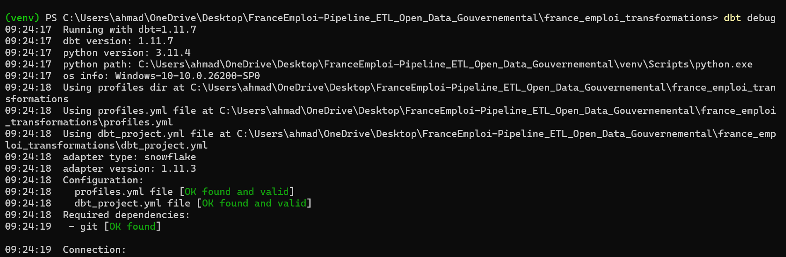
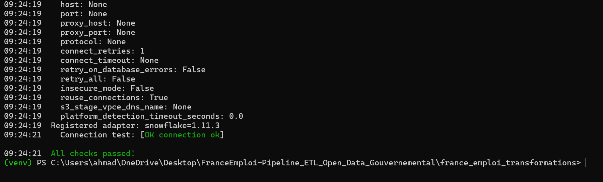

#### Debug dbt

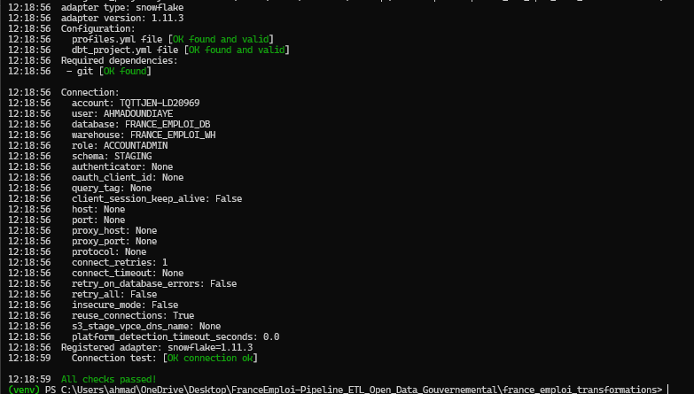

#### Exécution Staging

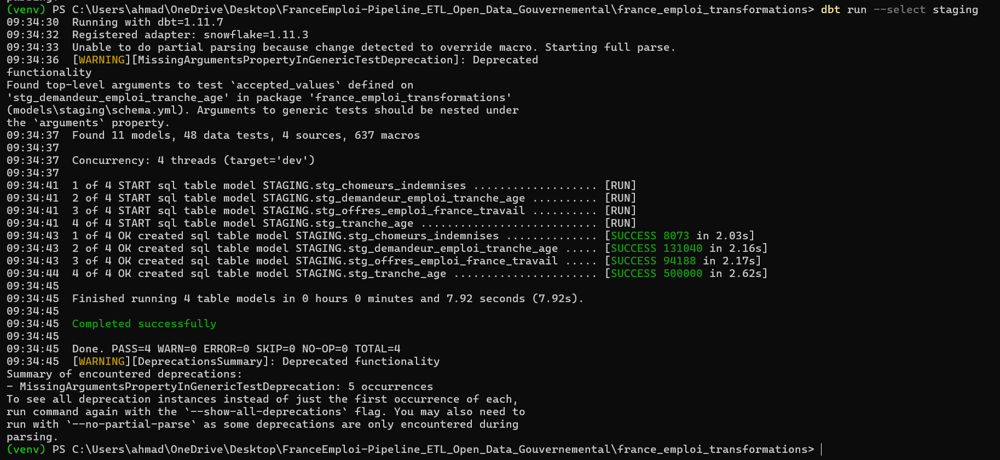

#### Schéma Staging

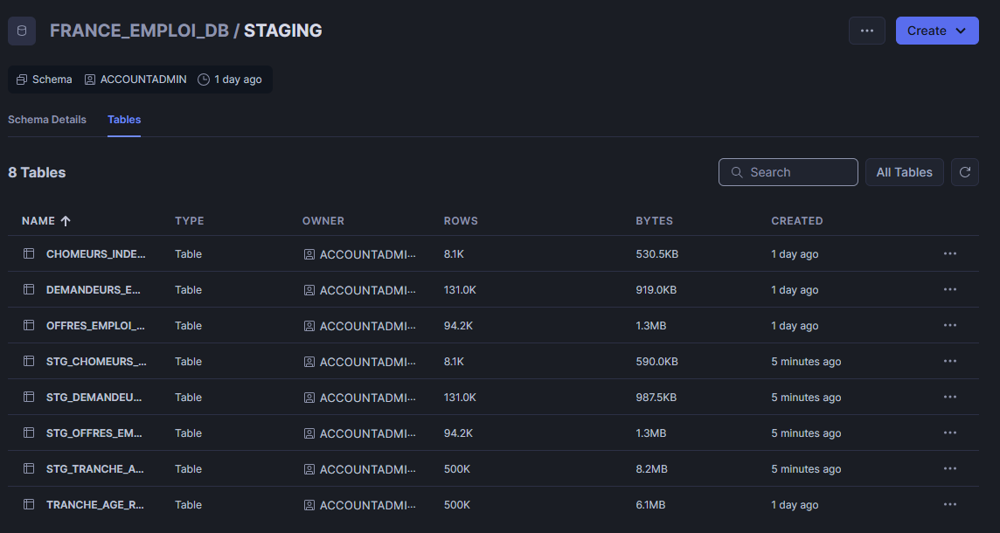

---

### Intermediate - Enrichissement et logique métier

Les modèles intermediate joignent les tables staging, calculent les métriques dérivées, et préparent les données pour l'agrégation. Ils sont matérialisés en **vues** dans le schéma `INTERMEDIATE`, pour refléter en permanence les dernières données staging sans coût de stockage supplémentaire.

**`int_territoire_chomage_population`**
Joint les données de chômage indemnisé (`stg_chomeurs_indemnises`) avec les estimations de population active (`stg_tranche_age`, âges 15–64, sexe `_T`) pour calculer le taux de chômage :

```
taux_chomage_indemnise = nb_alloc / population_active * 100
```

**`int_territoire_offres_enrichies`**
Joint les offres d'emploi (`stg_offres_emploi_france_travail`, offres collectées uniquement, sans ligne Total) avec la population active pour normaliser la densité d'offres :

```
offres_pour_1000_actifs = nb_offres_collectees / population_active * 1000
```

#### Exécution Intermediate

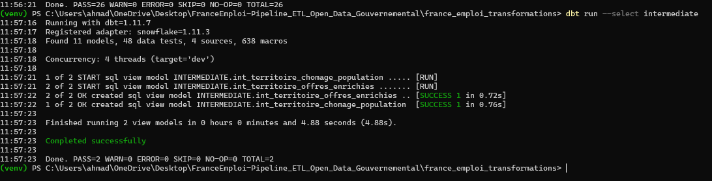

#### Schéma Intermediate

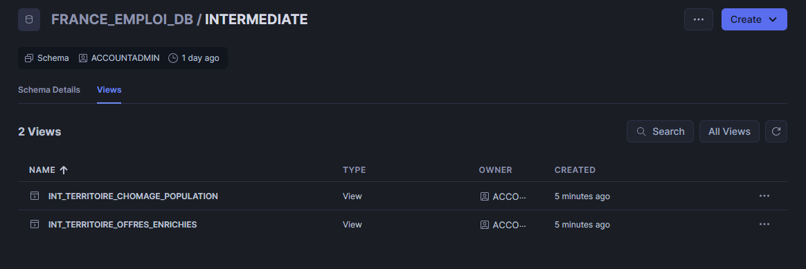

#### Vue - Chômage + Population

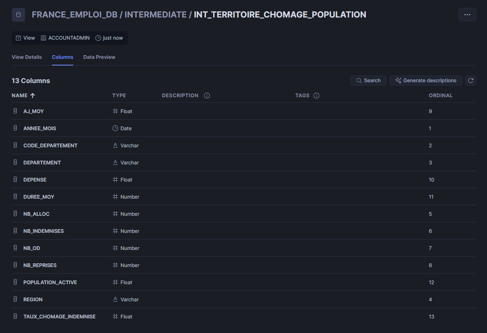

#### Vue - Offres enrichies

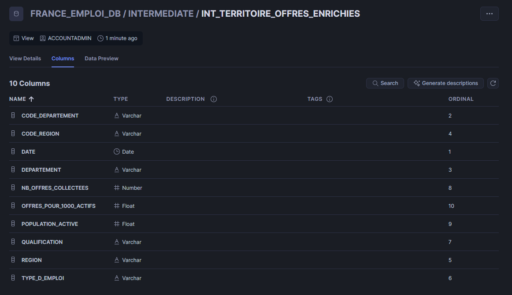

---

### Marts - Tables analytiques prêtes à l'emploi

Les marts constituent la couche de consommation finale. Ils sont matérialisés en **tables** dans le schéma `MARTS`, avec clustering pour la performance des requêtes.

| Modèle | Clustering | Description |
|--------|------------|-------------|
| `dim_territoire` | `code_departement` | Référentiel géographique - 101 départements dédupliqués avec QUALIFY |
| `dim_tranche_age` | - | Labels des tranches d'âge et indicateur `est_population_active` |
| `mart_territoire` | `code_departement` | Snapshot instantané par département - une ligne par unité géographique |
| `mart_desequilibre_emploi` | `annee_mois, code_departement` | Score mensuel de déséquilibre : `ratio_demandeurs_offres * (1 + taux_chomage/100)` |
| `mart_evolution_temporelle` | `annee_mois, code_departement` | Série temporelle complète avec évolution `LAG()` mois sur mois |

#### Exécution Marts

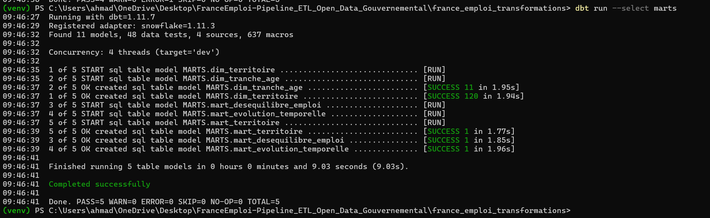

#### Schéma Marts

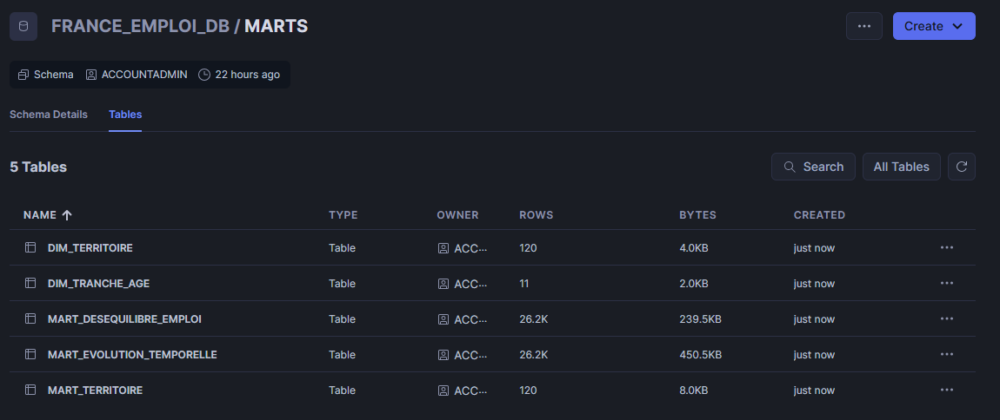

#### Vue d'ensemble de tous les modèles

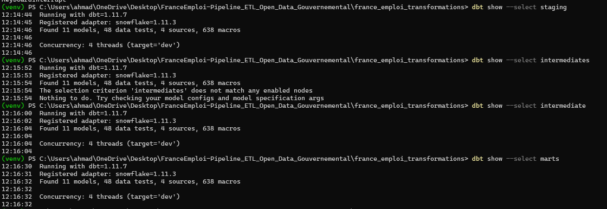

---

## 7. Qualité des données et tests

La qualité des données est assurée à chaque couche grâce aux tests built-in de dbt et aux tests singuliers personnalisés.

### Tests de schéma (par modèle)

- **`not_null`** sur toutes les colonnes de clé primaire et les champs métier critiques
- **`unique`** sur les clés primaires des dimensions (`code_departement`, `code_tranche_age`)
- **`accepted_values`** imposant les codes SDMX valides et les labels de référence en staging

Un macro override personnalisé (`macros/test_accepted_values.sql`) gère l'échappement SQL pour les valeurs contenant des apostrophes (ex. : `Offres d'emploi collectées`).

### Tests singuliers (assertions SQL personnalisées)

| Test | Ce qu'il vérifie |
|------|-----------------|
| `assert_taux_chomage_valide` | Le taux de chômage est compris entre 0 % et 50 % |
| `assert_couverture_departements` | Au moins 96 départements français présents dans mart_territoire |
| `assert_score_desequilibre_positif` | Le score de déséquilibre est non négatif pour tous les enregistrements |
| `assert_no_gap_temporel` | Aucun mois manquant dans la série temporelle des départements actifs |

#### Tests Staging

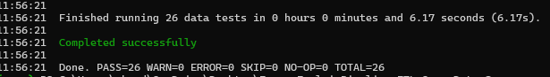

#### Tests Intermediate

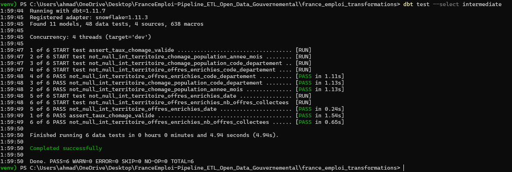

#### Tests Marts

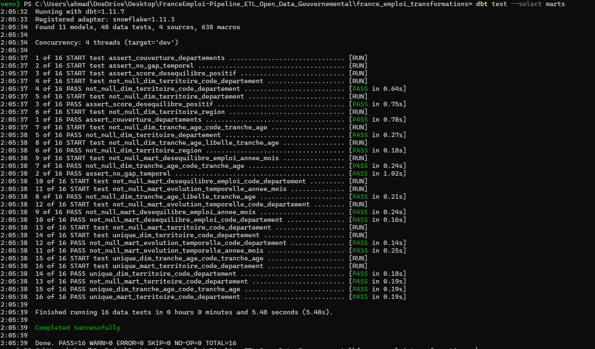

---

### Documentation dbt

dbt génère une documentation complète de la lignée des données, incluant les descriptions par colonne, la couverture des tests et les graphes de dépendances.

#### Génération et exposition de la documentation

```bash
dbt docs generate --project-dir france_emploi_transformations --profiles-dir france_emploi_transformations
dbt docs serve --project-dir france_emploi_transformations --profiles-dir france_emploi_transformations
```

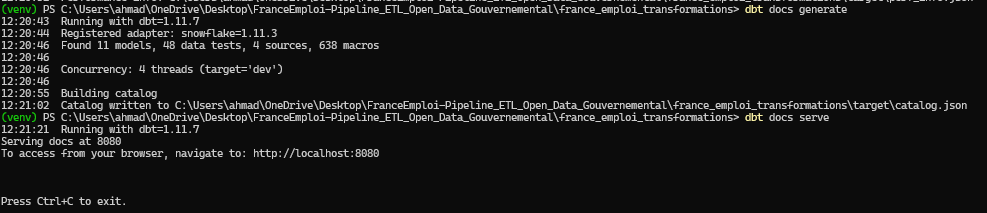

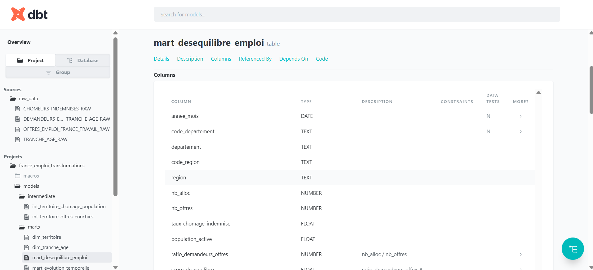

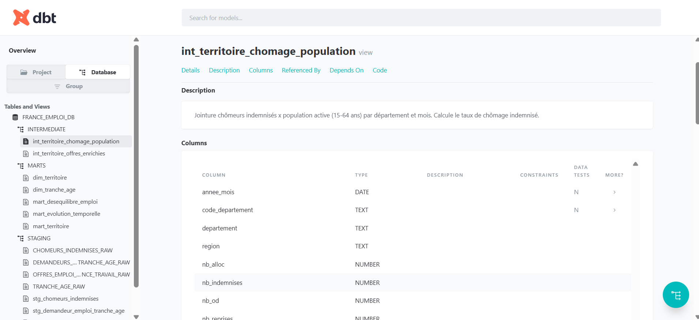

---

## 8. Infrastructure - Terraform

Toutes les ressources GCP sont provisionnées par Terraform avec un state distant stocké dans GCS.

**Ressources gérées :**

| Ressource | Détails |
|-----------|---------|
| `google_storage_bucket` | `france-emploi-datawarehouse-data` - zone d'atterrissage des fichiers bruts, règles de lifecycle, CMEK optionnel |
| `google_storage_bucket_object` | Placeholders `.keep` pour les 4 préfixes GCS |
| `google_pubsub_topic` (×4) | Un par source de données : `snowpipe-{source}` |
| `google_pubsub_subscription` (×4) | Liées à chaque topic, sans TTL |
| `google_storage_notification` (×4) | Déclenche les événements `OBJECT_FINALIZE` vers chaque topic |
| `google_service_account` (×2) | `bucket-raw-data-sa`, `snowpipe-sa` |
| Bindings IAM | Storage ObjectViewer, Pub/Sub subscriber/viewer pour les SAs Snowflake |

Le déploiement nécessite deux passes Terraform car les emails des service accounts Snowflake ne sont connus qu'après la première requête `DESC INTEGRATION`. Voir [infra/README.md](infra/README.md) pour la procédure complète en deux passes.

---

## 9. Structure du projet

```
.
├── dockerfile                          # Image Airflow personnalisée (dbt-snowflake + providers GCP)
├── docker-compose.yaml                 # Stack locale : Airflow (CeleryExecutor) + PostgreSQL + Redis
├── .env                                # Variables d'environnement (non commité)
│
├── dags/
│   ├── config/config.py                # ID projet GCP, nom du bucket, chemin des credentials
│   ├── utils/utils.py                  # Constructeurs de chemins GCS, logique de retry, helpers de tags
│   ├── collected/
│   │   ├── annuelle/tranche_age.py     # Population INSEE - annuel (1er janvier)
│   │   └── mensuelle/
│   │       ├── chomeurs_indemnise.py   # Allocataires UNEDIC - mensuel
│   │       ├── emploie.py              # Offres d'emploi DARES - mensuel
│   │       └── demandeur_emploie.py    # Demandeurs d'emploi DARES - mensuel
│   └── transformations/
│       ├── annuelle/dbt_transformations_annuelle.py
│       └── mensuel/dbt_transformations_mensuelle.py
│
├── france_emploi_transformations/      # Projet dbt
│   ├── dbt_project.yml
│   ├── models/
│   │   ├── sources.yml
│   │   ├── staging/                    # JSON → tables typées (schéma STAGING)
│   │   ├── intermediate/               # Jointures + métriques dérivées (schéma INTERMEDIATE, vues)
│   │   └── marts/                      # Agrégats + dimensions (schéma MARTS, tables)
│   ├── macros/
│   │   └── test_accepted_values.sql    # Override sécurisé contre les apostrophes
│   └── tests/                          # Tests singuliers personnalisés
│
├── init-snowflake-pipeline/
│   ├── init.sh                         # Script d'exécution automatisé
│   ├── connexion-snowflake-GCS.sql     # BDD, schémas, intégrations Storage + Pub/Sub Snowflake
│   ├── creation-stages-and-tables-raw.sql  # Format de fichier, stages externes
│   └── snowpipe.sql                    # Tables raw + Snowpipe auto-ingest
│
└── infra/                              # Terraform
    ├── provider.tf                     # Provider GCP, state distant GCS
    ├── variables.tf                    # Variables d'entrée + locals des flux
    ├── buckets.tf                      # Bucket GCS + placeholders de dossiers
    ├── pub_sub.tf                      # Topics, subscriptions, notifications GCS
    └── iam.tf                          # Service accounts et bindings IAM
```

---

## 10. Mise en route

### 10.1 Prérequis

| Outil | Version | Usage |
|-------|---------|-------|
| Docker + Docker Compose | Récent | Stack Airflow locale |
| Terraform | >= 1.0 | Provisionnement de l'infrastructure GCP |
| gcloud CLI | Récent | Création des service accounts |
| SnowSQL | Récent | Exécution des scripts Snowflake |
| Compte Snowflake | - | Entrepôt de données |
| Projet GCP | - | Storage + Pub/Sub |

---

### 10.2 Gestion des accès GCP - principe du moindre privilège

Le projet utilise **deux service accounts distincts**, chacun disposant uniquement des permissions strictement nécessaires à son rôle.

#### Clé 1 - Service Account Terraform (`infra/config/service_account_key.json`)

Utilisé exclusivement par Terraform lors du provisionnement de l'infrastructure. Ce compte dispose des droits d'administration sur les ressources GCP (Storage, Pub/Sub, IAM) mais n'est **jamais embarqué dans les conteneurs** applicatifs.

| Rôle attribué | Raison |
|---------------|--------|
| `roles/storage.admin` | Créer et configurer le bucket GCS |
| `roles/pubsub.admin` | Créer topics, subscriptions et leurs permissions |
| `roles/iam.serviceAccountAdmin` | Créer et gérer les service accounts applicatifs |
| `roles/resourcemanager.projectIamAdmin` | Attribuer des rôles au niveau projet |
| `roles/iam.roleAdmin` | Gérer les rôles personnalisés |
| `roles/monitoring.admin` | Accorder les droits monitoring à Snowflake |

La clé doit être placée dans **`infra/config/service_account_key.json`** avant de lancer `terraform init`. Ce chemin est listé dans `.gitignore` et ne doit jamais être commité.

#### Clé 2 - Service Account Airflow (`config/gcp/airflow-gcp-key.json`)

Utilisé par les DAGs Airflow pour écrire les fichiers collectés dans GCS. Ce compte a des droits restreints : uniquement `roles/storage.objectCreator` sur le bucket de données. Il ne peut pas créer ni modifier de ressources GCP.

| Rôle attribué | Raison |
|---------------|--------|
| `roles/storage.objectCreator` | Écrire les fichiers collectés dans le bucket raw |

La clé est montée dans le conteneur Airflow via le volume `config/gcp/` → `/opt/airflow/config/gcp/`.

**En résumé :**

```
Terraform (provisionnement)  →  infra/config/service_account_key.json   (droits admin, hors conteneurs)
Airflow   (runtime)          →  config/gcp/airflow-gcp-key.json          (droits restreints, dans le conteneur)
```

---

### 10.3 Étape 1 - Infrastructure GCP

**1a. Créer et configurer le service account Terraform :**

```bash
# Créer le service account
gcloud iam service-accounts create terraform-sa \
  --display-name="Terraform Service Account" \
  --project=<PROJECT_ID>

# Télécharger la clé dans le bon répertoire
gcloud iam service-accounts keys create infra/config/service_account_key.json \
  --iam-account=terraform-sa@<PROJECT_ID>.iam.gserviceaccount.com

# Attribuer les rôles requis
cd infra/
bash setup_config.sh
```

**Vérifier les rôles attribués :**

```bash
gcloud projects get-iam-policy <PROJECT_ID> \
  --flatten="bindings[].members" \
  --filter="bindings.members:terraform-sa@<PROJECT_ID>.iam.gserviceaccount.com" \
  --format="table(bindings.role)"
```

**1b. Créer le bucket Terraform state (une seule fois) :**

```bash
gsutil mb -l europe-west1 gs://france-emploi-datawarehouse-state
```

**1c. Première passe Terraform - provisionnement du bucket et de Pub/Sub :**

```bash
cd infra/
terraform init
terraform apply \
  -var="project_id=<PROJECT_ID>" \
  -var="email_props=<EMAIL>" \
  -var="gcs_storage_service_account=placeholder@x.iam.gserviceaccount.com" \
  -var="gcp_pubsub_service_account=placeholder@x.iam.gserviceaccount.com"
```

> Les emails des service accounts Snowflake sont nécessaires pour la seconde passe. Ils sont récupérés à l'Étape 2.

Voir [infra/README.md](infra/README.md) pour la procédure complète en deux passes.

---

### 10.4 Étape 2 - Initialisation Snowflake

Exécuter le script d'initialisation (nécessite SnowSQL et une première passe Terraform complète) :

```bash
export SNOWSQL_ACCOUNT=<account>.eu-west-1
export SNOWSQL_USER=<username>

cd init-snowflake-pipeline/
bash init.sh
```

Le script va :
1. Créer la base de données, les schémas, le warehouse et les intégrations Storage/Pub/Sub
2. Faire une pause et inviter à exécuter la seconde passe Terraform avec les emails des SAs Snowflake
3. Créer les stages externes et les tables raw
4. Créer les quatre objets Snowpipe avec auto-ingest activé

Récupérer les emails des service accounts Snowflake :

```sql
DESC INTEGRATION gcs_snowpipe_integration;
-- → copier STORAGE_GCP_SERVICE_ACCOUNT

DESC INTEGRATION NOTIF_CHOMEURS_INDEMNISES;
-- → copier GCP_PUBSUB_SERVICE_ACCOUNT
```

Puis compléter la seconde passe Terraform :

```bash
cd infra/
terraform apply \
  -var="project_id=<PROJECT_ID>" \
  -var="email_props=<EMAIL>" \
  -var="gcs_storage_service_account=<STORAGE_GCP_SERVICE_ACCOUNT>" \
  -var="gcp_pubsub_service_account=<GCP_PUBSUB_SERVICE_ACCOUNT>"
```

---

### 10.5 Étape 3 - Airflow (local)

**3a. Configurer les variables d'environnement :**

Créer un fichier `.env` à la racine du projet :

```dotenv
AIRFLOW_UID=50000
PROJECT_NAME=france_emploi
GCP_PROJECT_ID=<votre-gcp-project-id>
GCS_BUCKET_NAME=france-emploi-datawarehouse-data
```

Placer la clé du service account GCP pour Airflow dans :

```
config/gcp/airflow-gcp-key.json
```

**3b. Construire l'image Airflow personnalisée et démarrer la stack :**

```bash
docker compose build --no-cache
docker compose up airflow-init
docker compose up -d
```

Airflow est disponible sur `http://localhost:8081` (identifiants par défaut : `airflow` / `airflow`).

**3c. Déclencher les DAGs manuellement pour le chargement initial :**

```bash
# Déclencher d'abord les DAGs de collecte
docker compose exec airflow-scheduler airflow dags trigger france_emploi_chomeurs_indemnise
docker compose exec airflow-scheduler airflow dags trigger france_emploi_emploie
docker compose exec airflow-scheduler airflow dags trigger france_emploi_demandeur_emploie
docker compose exec airflow-scheduler airflow dags trigger france_emploi_tranche_age

# Puis déclencher les DAGs de transformation après la fin de la collecte
docker compose exec airflow-scheduler airflow dags trigger france_emploi_dbt_mensuelle
docker compose exec airflow-scheduler airflow dags trigger france_emploi_dbt_annuelle
```

---

### 10.6 Étape 4 - Configuration dbt

Le projet dbt s'exécute dans les conteneurs Airflow (monté sur `/opt/airflow/dbt`). Pour le développement local en dehors de Docker :

**4a. Configurer le profil Snowflake** dans `france_emploi_transformations/profiles.yml` :

```yaml
france_emploi_transformations:
  target: dev
  outputs:
    dev:
      type: snowflake
      account: <account>
      user: <username>
      password: <password>
      role: SYSADMIN
      database: FRANCE_EMPLOI_DB
      warehouse: FRANCE_EMPLOI_WH
      schema: PUBLIC
      threads: 4
```

**4b. Vérifier la connectivité :**

```bash
cd france_emploi_transformations/
dbt debug
```

**4c. Lancer le build complet :**

```bash
# Build complet avec tests
dbt build

# Build sélectif (sources mensuelles uniquement)
dbt build --select stg_chomeurs_indemnises+ stg_offres_emploi_france_travail+ stg_demandeur_emploi_tranche_age+

# Générer et exposer la documentation
dbt docs generate && dbt docs serve
```

---

## Notes importantes

- `infra/config/service_account_key.json` et `config/gcp/airflow-gcp-key.json` sont listés dans `.gitignore` et ne doivent **jamais** être commités.
- Les fichiers `*.tfvars` contenant les valeurs de variables spécifiques au projet sont également gitignorés.
- Le fichier `profiles.yml` Snowflake est gitignorés. Chaque développeur doit configurer son propre profil local.
- Les répertoires `venv/`, `logs/` et `france_emploi_transformations/target/` sont exclus du contrôle de version.
